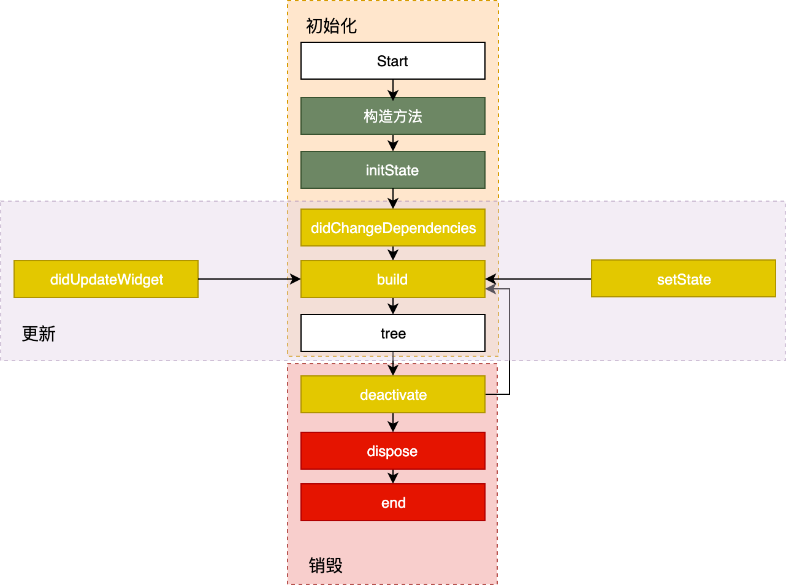

# Flutter核心技术与实战

[Flutter核心技术与实战](https://time.geekbang.org/column/intro/200)

## Dart核心特性

```dart
abstract class PrintHelper {
  printInfo() => print(getInfo());
  getInfo();
}

class Meta {
  double price;
  String name;
  // 成员变量初始化语法糖
  Meta(this.name, this.price);
}

// 定义商品 Item 类
class Item extends Meta {
  Item(name, price) : super(name, price);
  // 重载相加运算符
  Item operator +(Item item) => Item(name + item.name, price + item.price);
}

// 定义购物车类, mixin
class ShoppingCart extends Meta with PrintHelper {
  DateTime date;
  String code;
  List<Item> bookings;

  double get price =>
      bookings.reduce((value, element) => value + element).price;
  // 这里的语法糖有点别扭，非声明时定义的不能用this，需要传递给父类的构造函数来初始化
  ShoppingCart({name}): this.withCode(name: name, code:null);
  ShoppingCart.withCode({name, this.code}) : date = DateTime.now(), super(name, 0);

  getInfo() => '''
购物车信息:
-----------------------------
  用户名: $name
  优惠码: ${code ?? '没有'}
  总价: $price
  Date: $date
-----------------------------
''';
}

void main() {
  ShoppingCart.withCode(name: '张三', code: '123456')
  ..bookings = [Item('苹果', 10.0), Item('鸭梨', 20.0)]
  ..printInfo();
    ShoppingCart(name: '张三')
  ..bookings = [Item('苹果', 10.0), Item('鸭梨', 20.0)]
  ..printInfo();
}
```


## Widget生命周期





## 经典控件

* Text
* Image
  * Image.asset
  * Image.file
  * Image.network
  * FadeInImage.assetNetwork
  * CachedNetworkImage
* Button
  * FloatingActionButton
  * RaisedButton
  * FlatButton
* ListView
  * ListTile
  * ListView.builder
  * ListView.separated
  * ScrollController
  * ScrollNotification


## 布局控件

* 单子控件布局
  * Container
  * Padding
  * Center
* 多子控件布局
  * Row
  * Column
  * Expanded
* 层叠控件布局
  * Stack
  * Postitioned
* 组合和自绘
  * 把界面拆分到最小的组件单元，然后组合在一起
  * CustomPaint
* 主题
  * ThemeData
  * Theme


## 依赖管理

* 图片
* 配置
* 字体
* App图标
* 启动图
* dependencies
* pubsepct.yaml, pubspec.lock, .packages